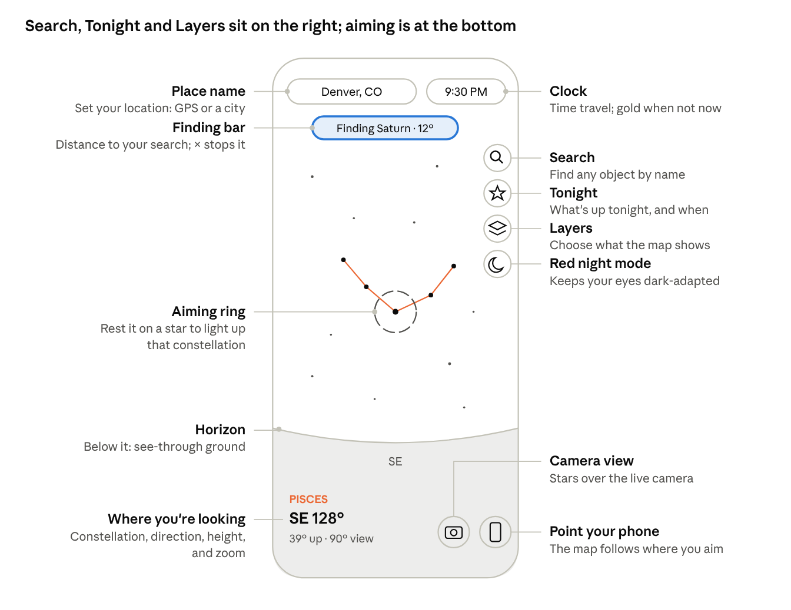

# Night Sky Finder

**Open the app:** https://yourusername.github.io/night-sky-v2/ · a beginner's guide to using it is below.

## What it is

Night Sky Finder is a map of the sky above you right now. It shows the stars, planets, Moon, constellations, galaxies and star clusters in their real positions for your location and time. Tap anything to learn what it is.

It runs in two places. Everything on the map works in both, but a few phone features only work from your own website.

| Feature | Inside Claude | Your GitHub site |
| --- | --- | --- |
| Sky map, search, Tonight, time travel, info cards | Yes | Yes |
| Point your phone at the sky | No, drag instead | Yes |
| Camera view | No | Yes |
| GPS location | No, pick a city | Yes |
| Works with no signal | No | Yes, after first visit |
| Home-screen icon | No | Yes |

If you're stargazing outside, use your GitHub site. Use the Claude version for planning at a desk.

## The screen at a glance

The right-hand column holds Search, Tonight, Layers and red mode; the two bottom-right buttons (camera and phone pointing) work only from your own website. Tap anything in the sky itself to learn about it.

## Looking around

Drag the sky with one finger to turn and tilt your view; pinch to zoom.

- **Drag** left and right to turn, up and down to look higher or lower. On a computer, drag with the mouse or use the arrow keys.
- **Pinch** to zoom in on a small area or out to see half the sky. On a computer, scroll the mouse wheel or press + and −.
- **Point your phone** instead of dragging: tap the phone button (bottom right) and hold the phone up toward the sky. The map follows wherever you aim, in portrait or landscape. Tap the button again to go back to dragging.
- **Look below the horizon** by dragging down past the ground line. The ground is see-through, so you can see the stars on the other side of the Earth, shown dimmer. Straight down is marked NADIR; straight up is ZENITH.

The faint ring in the middle of the screen is your aiming point. Rest it on any star that belongs to a constellation and that constellation's lines fade in, its stars brighten, and its name appears at the bottom left. Move away and they fade out.

The bottom-left readout tells you where you're looking: compass direction (SE 128°), how high (39° up), and how wide your view is (90° view).

## Finding things

To find something by name, tap the magnifying glass and type; to learn about something you can see, tap it.

**Search**

1. Tap the magnifying glass (top of the right-hand column).
2. Type a few letters: a planet (Saturn), a star (Vega), a constellation (Orion), a galaxy or nebula (Andromeda, M42), or a meteor shower (Orionids).
3. Tap a result. Each one says whether it's up now or below the horizon.

The map glides to it and circles it with a pulsing gold ring. A gold "Finding…" bar at the top shows how far away it is. Tap the × on that bar to stop.

**Following the gold arrow**

When the object is off screen, a gold arrow at the edge points the way, labeled with its name and distance in degrees. Turn or drag toward the arrow until the ring appears. This is most useful with phone pointing on: just follow the arrow with your phone.

**Info cards**

Tap any star, planet, galaxy, cluster or constellation name and a card slides up. It shows:

- A picture: the Moon's actual phase, Jupiter's four moons where they really are tonight, Saturn's real ring tilt, a constellation's figure, or a drawing of a galaxy or nebula.
- Where it is, when it rises and sets, how bright it is, and how far away.
- A short note, including whether you'll need binoculars or a telescope.
- **Point me there**, which starts the gold finder.
- **About \[constellation\]** on star cards, which opens that constellation's story.
- **Read more on Wikipedia**.

Tap the × or anywhere on empty sky to close the card.

## Tonight

The star button (second in the right-hand column) opens "What's up tonight": a ready-made viewing plan for your location. It also opens by itself the first time you use the app each day.

It lists, in order:

- **Sunset, sunrise, and when it's fully dark.** Faint objects need full darkness.
- **The Moon:** its phase, rise and set times, and a warning when its light will wash out faint galaxies.
- **Planets you can see,** with the hours they're up and when and where they're highest.
- **Close pairings,** such as the Moon passing near Jupiter.
- **Eclipses** in the next few weeks.
- **Meteor showers** happening now, when they peak, and the best time to watch.
- **The best galaxies, nebulae and clusters** to try, high in the sky after dark.

Tap any row marked FIND and the app takes you straight to it. Close the panel with the × at top right.

## Time travel

Tap the clock (top right) to see the sky at any other time.

- **Slider:** drag to move up to 12 hours earlier or later.
- **−1 day, −1 hr, +1 hr, +1 day:** jump in steps. Use the day buttons to plan a different night.
- **Play:** runs the sky forward at 15 minutes per second, so you can watch stars rise and set. Tap again to pause.
- **Now:** returns to the present.

While you're away from the present, the clock turns gold and shows the date. Tonight, search and info cards all follow the time you picked, so you can check, for example, where Saturn will be at 10 PM next Friday.

Times are shown in your phone's time zone. If you pick a city in another time zone, times still read in yours.

## Layers

The stacked-squares button (third in the right-hand column) controls what the map shows. Your choices are remembered.

| Setting | Options | What it does | Tip |
| --- | --- | --- | --- |
| Sky brightness | City, Suburb, Dark | Shows only the stars you could actually see from that kind of sky | Pick what matches where you're standing; Dark shows about 8,800 stars |
| Constellation lines | Off, Aim, All | Aim draws a figure when the center ring rests on one of its stars | Aim keeps the map clean; All is good for learning shapes |
| Ground | See-through, Solid | See-through lets you look below the horizon | Solid matches what you can really see |
| Constellation names | On, Off | Faint labels for all 88 constellations |  |
| Star names | On, Off | Names of the brighter stars |  |
| Galaxies, nebulae & clusters | On, Off | Symbols for 131 deep-sky objects; the panel shows a key | Galaxy = pink oval, nebula = green square, cluster = gold circle |
| Milky Way | On, Off | The soft glow of our galaxy | Brightest from a dark site in summer and early fall |
| Twinkle | On, Off | Stars shimmer, more near the horizon | Turn off if motion bothers you |
| Height grid | On, Off | Rings every 30° above and below the horizon | Helps judge how high to look |

## Phone tips

These work from your GitHub site, not inside Claude.

- **Set your location first.** Tap the place name (top left), then **Use GPS**, or pick the nearest city. Everything depends on this.
- **Camera view:** tap the camera button (bottom right). Your phone asks for camera permission; allow it. Stars, labels and planets are drawn over the live camera. If they sit a little off from the real thing, pinch to resize until they line up. The app remembers that setting.
- **Calibrate the compass** if directions look wrong: wave your phone in a slow figure-8 a few times. Stay a few feet from cars, metal railings and speakers, which throw compasses off.
- **Portrait or landscape** both work. Tilting the phone sideways tilts the view to match.
- **Red night mode:** tap the moon button (bottom of the right-hand column). It turns the whole screen red so your eyes stay adjusted to the dark. Turn your phone brightness down too.
- **Give your eyes time.** It takes about 20 minutes in the dark to see the faintest stars.

## Install it and use it offline

Open your GitHub site once with a signal, add it to your home screen, and it works anywhere after that, even with no service.

1. Open your site address (for example, yourusername.github.io/night-sky-v2) on your phone.
2. **iPhone:** in Safari, tap **Share**, then **Add to Home Screen**. **Android:** in Chrome, tap the **⋮** menu, then **Install app**.
3. Open it from the new icon. It runs full screen like a regular app.

The app saves itself on your phone the first time it loads. At a dark site with no signal, it still opens, with every star, planet and calculation working. When you're back online, it picks up any updates automatically the next time you open it.

## Troubleshooting

| Problem | Fix |
| --- | --- |
| Phone pointing or camera says it can't work | You're in the Claude version. Open your GitHub site instead. |
| The map points the wrong way | Wave the phone in a figure-8 to calibrate the compass, and move away from metal. |
| Stars don't line up with the camera | Pinch to resize the view until they match. |
| The sky looks wrong for where I am | Tap the place name (top left) and set your location. |
| The clock is gold and times look off | You're time-traveling. Tap the clock, then **Now**. |
| Very few stars show | Sky brightness may be set to City, or it's still twilight. Check Layers, or wait until fully dark. |
| Galaxy and cluster symbols are missing | They hide until the sky is dark. Also check that Galaxies, nebulae & clusters is on in Layers. |
| Constellation lines never appear | Set Constellation lines to Aim or All in Layers, then rest the center ring on a bright star. |
| The Tonight panel closed | Tap the star button in the right-hand column. |
| The site shows the old version | Close the app or tab completely and reopen it. |
| The site says 404 | Wait two minutes after uploading, and check that index.html is at the top level of the repository. |

## Plain-English glossary

| Term | Meaning |
| --- | --- |
| Magnitude (mag) | How bright something looks. Lower is brighter: Venus is about −4, the faintest stars you can see from a dark site are about 6.5. |
| Degrees (°) | How far apart things are on the sky. Your fist held at arm's length covers about 10°. |
| Direction (azimuth) | Compass bearing: 0° north, 90° east, 180° south, 270° west. |
| Height (altitude) | Angle above the horizon: 0° on the horizon, 90° straight overhead. Negative means below the horizon. |
| Zenith / Nadir | Straight up / straight down. |
| Constellation | One of 88 official regions of the sky, each with a traditional star pattern. |
| Deep-sky object | Anything beyond our solar system that isn't a single star: galaxies, nebulae and star clusters. |
| Messier object (M31, M42…) | One of 110 bright deep-sky objects listed by Charles Messier in the 1700s; great first targets. |
| Galaxy | A separate system of billions of stars, far beyond the Milky Way. |
| Nebula | A cloud of glowing gas and dust, often where stars are being born. |
| Open / globular cluster | A loose group of young stars / a dense ball of very old stars. |
| Radiant | The spot a meteor shower's meteors seem to stream from. |
| Light-year (ly) | The distance light travels in a year, about 6 trillion miles. |
| AU | The Earth–Sun distance, about 93 million miles. Used for planets. |
| Twilight | The time after sunset (or before sunrise) when the sky isn't fully dark yet. |
